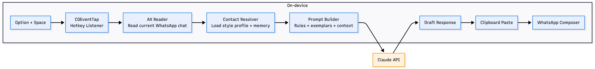
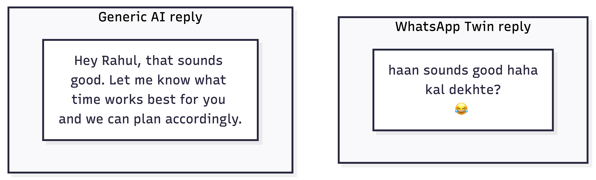
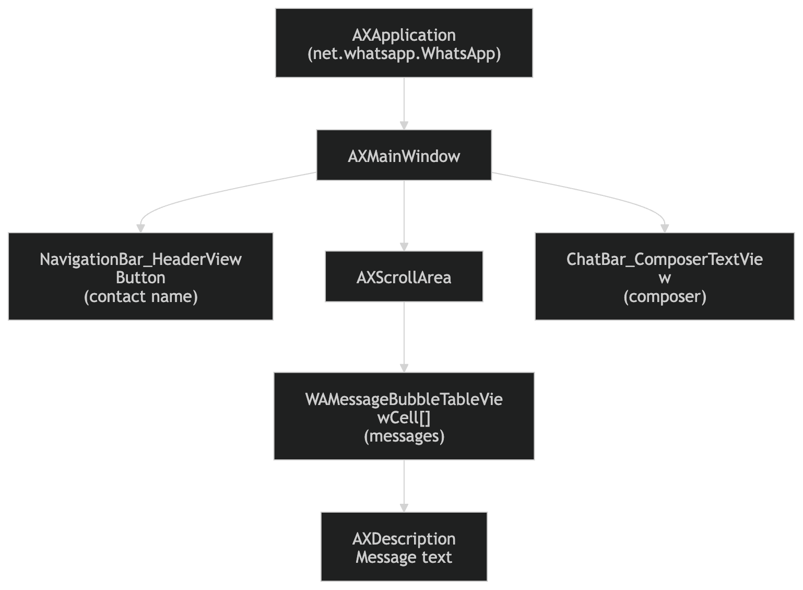
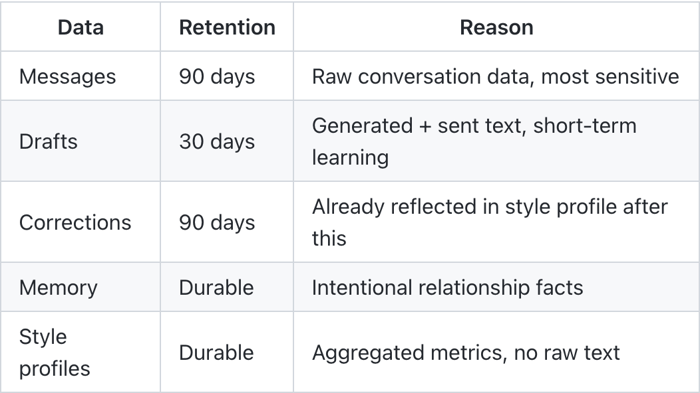
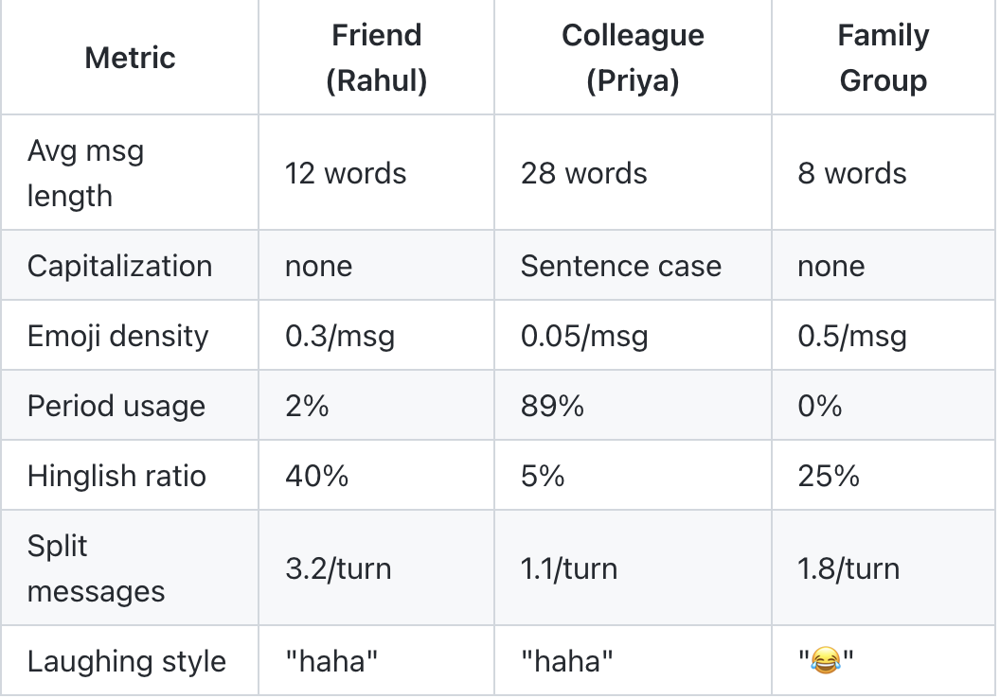
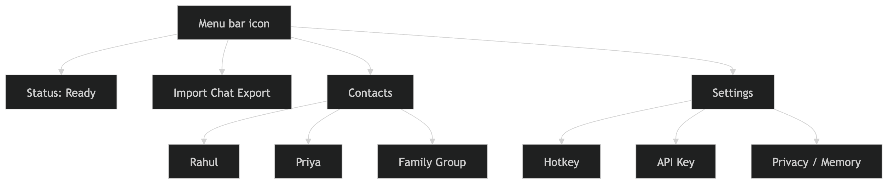
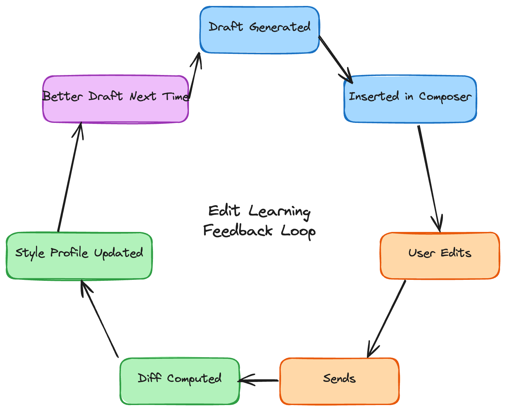
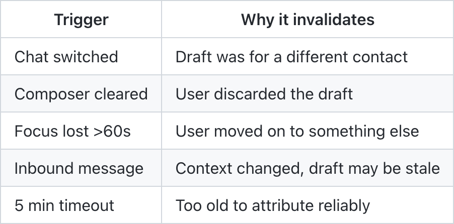

# Building WhatsApp Twin: An AI That Texts Like Me

> **TL;DR**: I built a macOS app that sits in the menubar, listens for Option+Space while WhatsApp is open, reads the current conversation via Accessibility APIs, and inserts a style-matched draft reply in ~2 seconds. It learns my texting quirks per contact — emoji density, Hinglish mixing, capitalization, message splitting — and gets better over time by tracking what I actually send vs. what it drafted. 81 tests, ~4,500 lines of Python, never sends a message on its own.

---

I built a macOS desktop app that reads my WhatsApp conversations and drafts replies in my exact texting style. The AI only drafts — I always press Send myself. Here's how I went from idea to a working prototype in about two weeks.



## The Problem

I text differently with different people. With close friends, it's all lowercase, Hinglish (Hindi-English mix), heavy emoji usage, and split messages. With colleagues, it's proper sentences with punctuation. With family groups, it's somewhere in between.

Every AI writing tool I tried produced generic, obviously-AI text. I wanted something that could learn *my* patterns — per contact — and generate drafts that even my friends wouldn't question.



## The Idea

Press a hotkey while WhatsApp is open. The app reads the current conversation, understands the context, and inserts a draft reply into the message box — styled exactly like I'd write it. I review, maybe tweak a word, and hit Enter.

Target: 2-3 seconds from hotkey to draft.

## Technical Spike: Can This Even Work?

Before writing any real code, I needed to answer three questions:

**1. Can I read WhatsApp's messages programmatically?**

WhatsApp Desktop on Mac is a Catalyst app (an iPad app running on macOS). This turned out to be both good and bad. Good: it exposes accessibility (AX) elements. Bad: it doesn't behave like a normal AppKit app.

I opened Accessibility Inspector and mapped the UI tree:



Key discoveries:
- `app.windows()` returns an empty list (Catalyst quirk). You need `app.AXMainWindow` instead.
- Message text lives in the `AXDescription` attribute, not `AXValue`.
- The composer text area (`ChatBar_ComposerTextView`) doesn't support `AX setValue()`.
- Message cells use the identifier `WAMessageBubbleTableViewCell`.

**2. Can I insert text into the composer?**

Since `setValue()` doesn't work on the Catalyst composer, I had to fall back to clipboard paste: save the current clipboard, set the draft as clipboard content, simulate Cmd+V via AppleScript, then restore the original clipboard. Not elegant, but it works.

**3. Can I register a global hotkey?**

QuickMacHotKey (the go-to for macOS hotkeys) is a Swift package — not pip-installable. I used Quartz's `CGEventTap` instead, which lets you intercept keyboard events at a low level. Option+Space was my chosen trigger.

The spike confirmed all three were feasible. Latency from hotkey to Claude API response to paste: about 2 seconds with Claude Sonnet.

## Phase 1: Export Parser + Storage

WhatsApp lets you export chat history as `.txt` files. The format looks simple but has surprisingly many edge cases:

```
[1/15/24, 2:30:45 PM] Anmol Sahu: haha yeah sounds good
[1/15/24, 2:31:02 PM] Rahul: btw did you see the match yesterday
```

Complications I hit:
- **Unicode garbage**: `\u200e` (left-to-right marks) and `\u202f` (narrow no-break spaces before AM/PM) scattered throughout.
- **No dash separator**: Unlike some regional formats, Indian WhatsApp exports don't have a dash between the timestamp and sender name.
- **Multiline messages**: A message can span multiple lines, and the only delimiter is the next timestamp line.
- **Date ambiguity**: When day and month are both ≤12, is `01/02/24` January 2nd or February 1st? I check both interpretations and pick the one that maintains chronological order.

For storage, I used SQLite with TTL-based retention: messages auto-purge after 90 days, drafts after 30 days, corrections after 90 days. Memory entries (facts about contacts) are durable — they only go away if you explicitly delete a contact.



I wanted SQLCipher for encryption, but `pysqlcipher3` doesn't support Python 3.14. Plain SQLite for now — encryption is on the roadmap.

## Phase 2: Style Analysis

This is where it gets interesting. For each contact, I analyze every message I've sent to build a quantitative style profile:

- **Message structure**: average length (chars/words), messages per turn, how often I split into multiple messages
- **Language mixing**: Hinglish frequency, common Hindi words in Roman script
- **Emoji patterns**: density, top emojis, laughing style ("haha" vs "lol" vs "😂")
- **Punctuation**: period usage, capitalization style, ellipsis frequency
- **Abbreviations**: word substitutions ("gonna", "wanna"), filler words
- **Sentence rhythm**: words per sentence, connector style

This is all pure Python — no API calls. Just regex, counters, and statistics over the message history.



On top of the quantitative analysis, there's an optional qualitative pass: send 50 representative messages to Claude and ask it to describe the tone, rhythm, and quirks in structured JSON. This captures things that are hard to quantify — like sarcasm patterns or how I transition between topics.

## Phase 3: The Core Flow

The heart of the app is a single function that fires when you press Option+Space:

1. **Verify WhatsApp is frontmost** (safety guard — never paste into the wrong app)
2. **Read the current chat** via Accessibility API — contact name from the header, last ~20 visible messages from the scroll area, composer element reference
3. **Resolve the contact** against the database to load their style profile and memories
4. **Build the prompt** — system prompt with style rules + exemplar messages, user prompt with conversation context
5. **Stream the response** from Claude for lower perceived latency
6. **Re-verify WhatsApp is still frontmost** (it might have lost focus during the 2-second generation)
7. **Insert the draft** into the composer via clipboard paste

The prompt is carefully structured. The system prompt tells Claude exactly how to write: match my capitalization style, emoji density, Hinglish mixing ratio, message splitting pattern, and abbreviation preferences. It includes 10-20 representative messages from my history as exemplars. The conversation context goes in XML-tagged delimiters to prevent prompt injection from adversarial messages.

A critical safety invariant: **the app never simulates Enter/Return**. It only pastes text into the composer. I always send manually.

## Phase 4: Menubar App

I used `rumps` to build a menubar app — a small icon in the macOS menu bar that shows status, lets you import exports, manage contacts, and configure settings. The app runs the hotkey listener in a background thread and the rumps event loop on the main thread.



One gotcha: rumps requires the NSApplication event loop to be running before you can do anything useful. Preflight checks (accessibility permissions, WhatsApp running) had to be deferred via a `@rumps.timer(1)` callback that fires once after the event loop starts.

## Phase 5: Memory System

Style matching gets you 80% of the way. Memory gets you the rest.

The memory system stores durable facts about each contact: their birthday, job, where they live, shared events, commitments ("I'll send you that article"), and relationship context ("we went to college together").

Memory extraction is opt-in and LLM-powered. It processes conversation history in chunks of 200 messages, asking Claude to extract concrete facts in structured JSON. The user is explicitly informed that conversation data will be sent to the API.

At generation time, relevant memories are injected into the prompt context. This means the AI knows that when Rahul mentions "the project," he's talking about his startup, not a school assignment.

## Phase 6: Edit Learning

This is the feedback loop that makes the system get better over time.



After a draft is inserted, the app monitors the AX tree for what happens next:
- If the user sends a message that's similar to the draft (similarity > 0.3), it captures the actual sent text
- It computes a word-level diff between the draft and what was sent
- It categorizes the corrections: did the user shorten it? Add emoji? Switch language? Change tone?
- It updates the style profile using an exponential moving average (alpha = 0.15)

The session tracking is surprisingly tricky. A "draft session" gets invalidated on any of these triggers:



After every 10 high-confidence corrections per contact, the system re-runs the qualitative LLM analysis to capture any style drift.

## Phase 7: Multi-Draft + OCR Fallback

Sometimes the first draft isn't quite right. Press Option+Space again on the same chat, and you get a variant — a different take with slightly different wording. Up to 3 variants, then it cycles through them without making new API calls.

The composer clear for variants was its own challenge. WhatsApp's Catalyst composer doesn't respond to Cmd+A (select all) via System Events. I had to use Cmd+Down (move to end) → Cmd+Shift+Up (select to start) → Delete. A workaround I discovered through trial and error.

For the rare cases where the Accessibility API can't read message text (it happens with certain message types), there's a Vision framework OCR fallback that captures the WhatsApp window and extracts text visually.

## Group Chat Support

Individual chats were working well, so I extended support to group chats. The key insight: people text differently in groups than in 1-on-1 conversations. Rather than trying to match individual profiles within a group, I profile groups as their own entity.

Group detection works two ways:
- **From AX**: if there are multiple distinct senders in received messages, it's a group
- **From imports**: if an export has more than 2 participants, it's a group

Groups get their own contact entry with an `is_group` flag, their own style profile (based on how I write in that specific group), and group-specific prompt templates that consider conversation flow and dynamics rather than just replying to one person.

## What I Learned

**Catalyst apps are weird.** Half the standard macOS accessibility patterns don't work. `app.windows()` returns nothing. `setValue()` is unavailable on text fields. You have to discover every quirk through Accessibility Inspector and trial-and-error.

**Style matching is more than word choice.** The biggest tells that text is AI-generated aren't the words — it's the structure. Message length, whether you use periods, how you split messages, your emoji-to-text ratio. Get those right and the content almost doesn't matter.

**The clipboard is a shared resource.** Briefly overwriting the system clipboard to paste text feels hacky, and it is. But when the AX APIs don't give you a better option, you work with what you have. Always restore the original clipboard.

**Prompt engineering for style is hard.** Telling Claude "write like me" doesn't work. You need to show it exactly what "like me" means: quantitative metrics, concrete examples, explicit rules about capitalization and emoji. The system prompt for this app is substantial.

**Edit learning is the secret weapon.** The style profile from imports gives you a starting point. But the real magic is the feedback loop — every time you edit a draft before sending, the system learns from the correction. After a few dozen edits per contact, the drafts noticeably improve.

## The Numbers

- **81 tests** covering parsing, style analysis, group detection, prompt building, contact matching, and safety guards
- **~2 seconds** end-to-end latency (hotkey to draft in composer)
- **~4,500 lines** of Python across 25 modules
- **16 days** from first spike to working prototype

## What's Next

The biggest limitations right now are platform lock-in (macOS only, WhatsApp only) and the visible-messages-only constraint. I'd love to add scroll-back context, media awareness (knowing someone sent a photo), and reaction detection from the AX tree.

Longer term, the dream is a local model fine-tuned on my messages — zero data leaves the device, instant responses, and even better style matching. But that's a project for another month.

For now, I have something that genuinely saves me time and produces drafts that my friends can't tell apart from my actual messages. That was the goal.

---

**P.S.** The entire codebase — planning, architecture, implementation, debugging, and this blog post — was built in collaboration with Claude Code (Anthropic's CLI agent). It wrote the code, I tested it on real conversations and reported bugs. The Catalyst AX quirks, the composer clear workaround, the group-as-entity insight — all discovered through this back-and-forth. If you're building something that touches macOS system APIs, having an AI pair programmer that can hold the full project context across sessions is genuinely transformative.

**P.P.S.** If you try this with your own WhatsApp, the first draft will probably be terrible. Import at least 500+ messages per contact and run `--analyze` before judging. The style profiles need data to work with — garbage in, garbage out.

---

## Suggested Visuals

*Notes for when publishing this blog — add these visuals to break up the wall of text:*

### Diagrams

1. **Architecture diagram** (top of post, after TL;DR) — show the data flow:
   `Option+Space → CGEventTap → AX Reader → Prompt Builder → Claude API → Clipboard Paste → Composer`
   Keep it horizontal, left-to-right. Color-code: blue for on-device, orange for API call.

2. **Edit learning feedback loop** (Phase 6 section) — circular diagram:
   `Draft Generated → Inserted in Composer → User Edits → Sends → Diff Computed → Style Profile Updated → Better Draft Next Time`

3. **AX tree hierarchy** (Technical Spike section) — tree diagram of WhatsApp's accessibility structure:
   ```
   AXApplication (net.whatsapp.WhatsApp)
   └── AXMainWindow
       ├── NavigationBar_HeaderViewButton (contact name)
       ├── AXScrollArea
       │   └── WAMessageBubbleTableViewCell[] (messages)
       │       └── AXDescription: "Message from Rahul: hey what's up"
       └── ChatBar_ComposerTextView (composer)
   ```

### Tables

4. **Style profile comparison table** (Phase 2 section) — show how style differs per contact:

   | Metric | Friend (Rahul) | Colleague (Priya) | Family Group |
   |--------|---------------|-------------------|--------------|
   | Avg msg length | 12 words | 28 words | 8 words |
   | Capitalization | none | Sentence case | none |
   | Emoji density | 0.3/msg | 0.05/msg | 0.5/msg |
   | Period usage | 2% | 89% | 0% |
   | Hinglish ratio | 40% | 5% | 25% |
   | Split messages | 3.2/turn | 1.1/turn | 1.8/turn |
   | Laughing style | "haha" | "haha" | "😂" |

5. **Data retention table** (Phase 1 section):

   | Data | Retention | Reason |
   |------|-----------|--------|
   | Messages | 90 days | Raw conversation data, most sensitive |
   | Drafts | 30 days | Generated + sent text, short-term learning |
   | Corrections | 90 days | Already reflected in style profile after this |
   | Memory | Durable | Intentional relationship facts |
   | Style profiles | Durable | Aggregated metrics, no raw text |

6. **Session invalidation table** (Phase 6 section):

   | Trigger | Why it invalidates |
   |---------|-------------------|
   | Chat switched | Draft was for a different contact |
   | Composer cleared | User discarded the draft |
   | Focus lost >60s | User moved on to something else |
   | Inbound message | Context changed, draft may be stale |
   | 5 min timeout | Too old to attribute reliably |

### Screenshots / Mockups

7. **Before/after comparison** (The Problem section) — side-by-side showing:
   - Left: "Generic AI reply" — proper grammar, formal tone, obviously robotic
   - Right: "WhatsApp Twin reply" — matching the user's actual style with the right emoji, casing, and Hinglish

8. **Menubar app screenshot** (Phase 4 section) — show the menubar icon with its dropdown: status indicator, import option, contacts list, settings.

9. **Terminal output screenshot** (Phase 1 section) — show the CLI importing an export:
   ```
   $ whatsapp-twin import "WhatsApp Chat with Rahul.txt" --analyze
   [I] Imported 1,247 messages from 'WhatsApp Chat with Rahul.txt'
   [I] Building style profile for Rahul...

   --- Style Profile: Rahul ---
     avg_message_length: 11.3
     emoji_density: 0.28
     hinglish_ratio: 0.42
     capitalization: lowercase
     period_usage: 0.02
     top_emojis: ['😂', '🫡', '💀']
     laughing_style: haha
   ```

10. **Demo GIF** (The Idea section or top of post) — screen recording showing:
    Option+Space pressed → "Generating..." in menubar → draft appears in WhatsApp composer → user tweaks one word → presses Enter. 3-4 seconds total.

### Code Snippets (styled as figures, not inline)

11. **Prompt structure** (Phase 3 section) — show a simplified version of the system prompt with style rules, to illustrate how specific the instructions are.

12. **AX reading code** (Technical Spike section) — the 5-line snippet that reads messages from WhatsApp's AX tree, showing how non-obvious `AXDescription` is.

---

*Built with Python, PyObjC, Claude API, and an unhealthy amount of time in Accessibility Inspector.*
